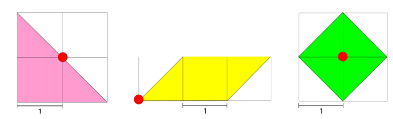
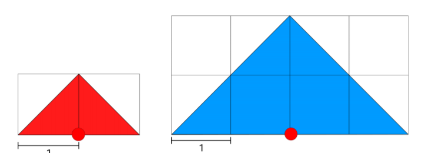
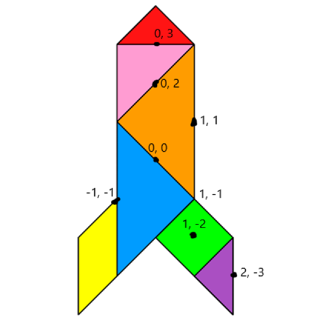

# Transformations
## Original Shapes

  

Assuming the center of the tangram as shown in the map below, then we can deduce all the coordinates of the interest points to draw the tangram, as we know the dimensions of all components forming the tangram.  
## Tangram Coordinates Map
  

As we are mapping a 2D image onto the **xOy** plane, all rotations are in the **z** axis. And so the transformations needed are:  
## Red Triangle
Translation to point **(x, y, z)**: (0, 3, 0) from the origin -> **dx** = (0, 3, 0).  
## Pink Triangle
The original triangle has the rectangle angle in the same position but the hypotenuse points upwards.  
So to obtain the triangle needed for the tangram we need to apply a rotation of 90º clockwise direction, this is an angle of rotation of -90º (-π/2). After that we apply a translation from the origin to **(x, y, z)**: (0, 2, 0) -> **dx** = (0, 2, 0).  
## Orange Triangle
The original image has the rectangle angle pointing downwards.  
So to obtain the triangle needed for the tangram we need to rotate the triangle by 90º in couter-clockwise direction, this is an angle of rotation of +90º (π/2). After that we translate the triangle from the origin to **(x, y, z)**: (1, 1, 0) -> **dx** = (1, 1, 0).  
## Blue Triangle
Similiar to the orange triangle, but now we rotate in clockwise direction, this is an angle of rotation of -90º (-π/2). After that we translate the triangle from the origin to **(x, y, z)**: (-1, -1, 0) -> **dx** = (-1, -1, 0).  
## Yellow Parallelogram
The parallelogram needed for the tangram is inverted, so we first modified the parallelogram and switched the vertices on the object itself, as the original parallelogram won't ever obtain the parallelogram needed. After that we need to apply a rotation of 90º in counter-clockwise direction, this is an angle of rotation of +90º (π/2). And finally, a translation from the origin to **(x, y, z)**: (-1, -1, 0) -> **dx** = (-1, -1, 0).
## Green Diamond
To obtain the diamond it's just needed a translation from the origin to **(x, y, z)**: (1, -2, 0) -> **dx** = (1, -2, 0).
## Purple Triangle
To obtain the triangle needed we need to apply a rotation of 90º in counter-clockwise direction, this is an angle of rotation of +90º (π/2). Followed by a translation from the origin to **(x, y, z)**: (2, -3, 0) -> **dx** = (2, -3, 0).  

With this transformations we obtain the tangram desired.
