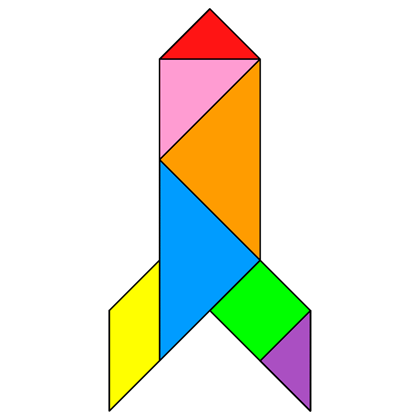
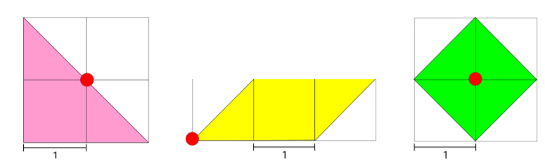
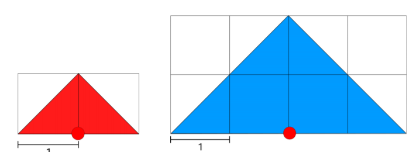
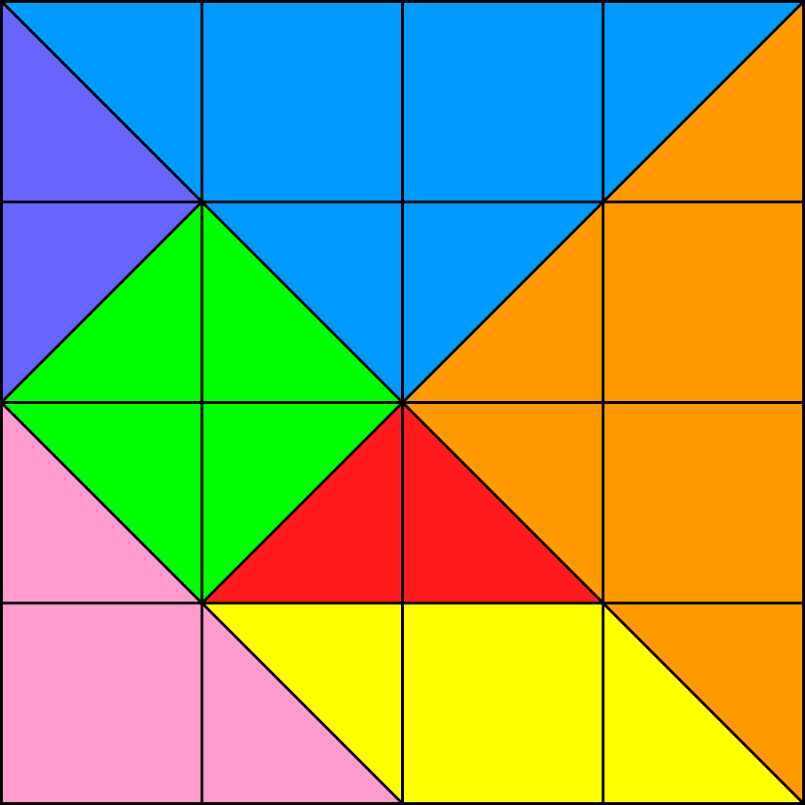
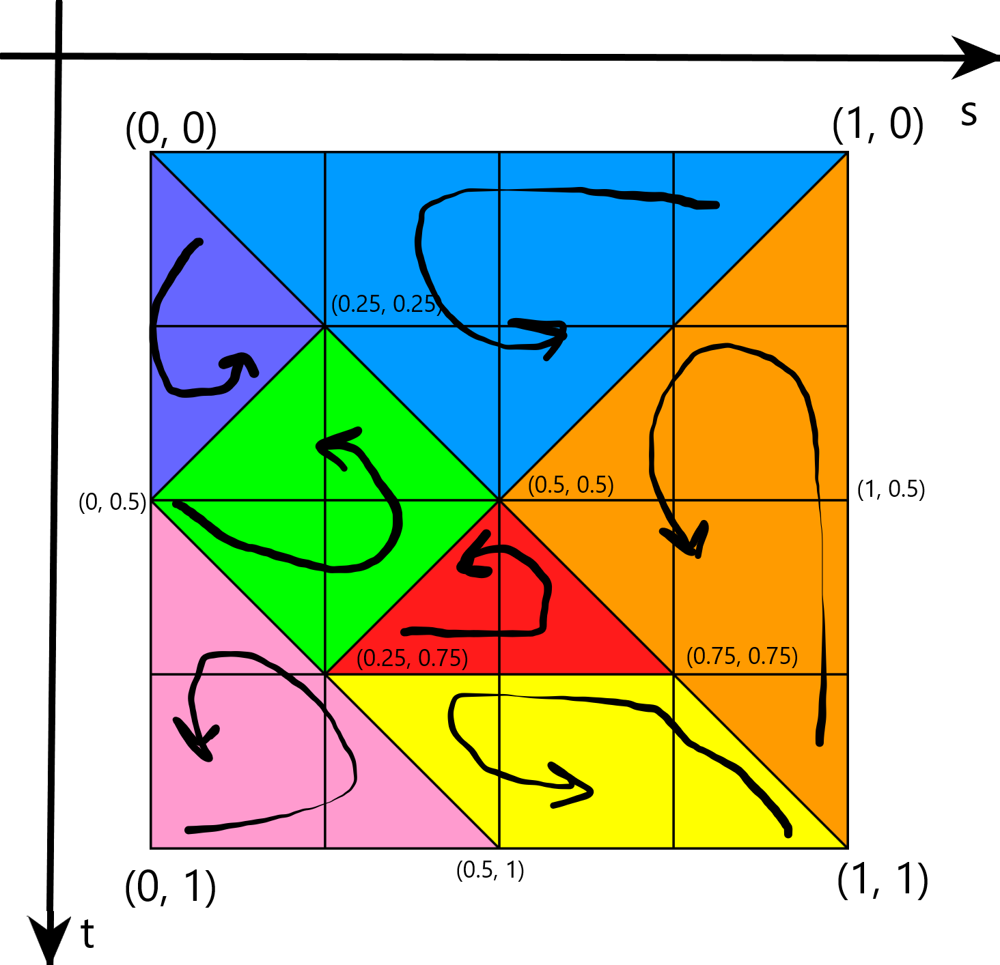

# Textures

## Tangram


## Original Shapes

  

## Texture



## Tangram Coordinates Map


All objects vertices are in counter clock wise with the starting vertice being the leftmost vertice, and if there are multiple leftmost then the one at the bottom. The only exception is the parallelogram that was inverted, and so it starts on the rightmost vertice. This information is useful for defining the texture coordinates.

*Note: the starting point and direction is show in the image, the start being the beginning of the arrow*

We obtain:
## Red Triangle
```js
this.texCoords = [
    0.25, 0.75,
    0.75, 0.75,
    0.5, 0.5
];
```
## Pink Triangle
```js
this.texCoords = [
    0.0, 1.0,
    0.5, 1.0,
    0.0, 0.5
];
```
## Orange Triangle
```js
this.texCoords = [
    1.0, 1.0,
    1.0, 0.0,
    0.5, 0.5
];
```
## Blue Triangle
```js
this.texCoords = [
    1.0, 0.0,
    0.0, 1.0,
    0.5, 0.5
];
```
## Yellow Parallelogram
```js
this.texCoords = [
    1.0, 1.0,
    0.75, 0.75,
    0.25, 0.75,
    0.5, 1.0
];
```
## Green Diamond
```js
this.texCoords = [
    0.0, 0.5,
    0.25, 0.75,
    0.5, 0.5,
    0.25, 0.25
];
```
## Purple Triangle
```js
this.texCoords = [
    0.0, 0.0,
    0.0, 0.5,
    0.25, 0.25
];
```
